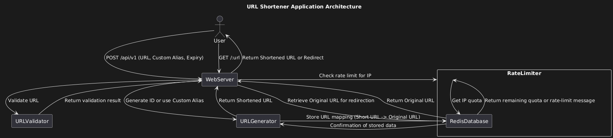

# URL Shortener

<p float="left">
  
    
    
    
    
</p>

A URL Shortener application built in Go, which allows users to generate short links for long URLs. It uses Redis as a database to store the short URLs and includes an IP-based rate limiter to control the number of requests allowed per user.

## Features

- **URL Shortening**: Generate short, unique URLs.
- **Custom Short URLs**: Users can provide a custom alias for the shortened URL.
- **Rate Limiting**: Limits requests per IP to prevent abuse, with a reset interval.
- **Redis Database**: Stores mappings between original and shortened URLs.
- **Docker Setup**: Includes Docker support for easy Redis setup.

## Prerequisites

- Go 1.19 or higher
- Redis server (can be set up via Docker)
- [gofiber/fiber](https://github.com/gofiber/fiber) for the web framework
- [godotenv](https://github.com/joho/godotenv) for managing environment variables

## Installation

1. Clone the repository:
   ```bash
   git clone https://github.com/Ravikisha/URLShortener.git
   cd URLShortener
   ```

2. Install dependencies:
   ```bash
   go mod tidy
   ```

3. Set up the environment variables by creating a `.env` file in the project root with the following content:
   ```plaintext
   DB_ADDR="localhost:6379"        # Redis address
   DB_PASSWORD=""                  # Redis password if any
   APP_PORT=":6767"                # Application port
   DOMAIN="localhost:6767"         # Domain to use for shortened URLs
   APP_QUOTA=10                    # Rate limit quota per IP
   ```

4. Run the application:
   ```bash
   go run main.go
   ```

### Running Redis with Docker

To set up Redis using Docker, run the following command:
```bash
docker run --name url-shortener-redis -p 6379:6379 -d redis
```

## API Endpoints

### 1. Shorten URL

**Endpoint:** `/api/v1`

**Method:** `POST`

**Request Body:**
```json
{
  "url": "https://your-long-url.com",
  "short": "customAlias",         // Optional custom short URL alias
  "expiry": 24                    // Optional expiry in hours, defaults to 24 hours
}
```

**Response:**
```json
{
  "url": "https://your-long-url.com",
  "short": "localhost:6767/customAlias",
  "expiry": 24,
  "x-rate-remaining": 9,
  "x-rate-limit-reset": 30
}
```

### 2. Resolve Short URL

**Endpoint:** `/:url`

**Method:** `GET`

**Description:** Redirects to the original URL associated with the short URL.

## Environment Variables

The `.env` file should contain:

- `DB_ADDR`: Redis server address.
- `DB_PASSWORD`: Redis server password, if any.
- `APP_PORT`: The port on which the application will run.
- `DOMAIN`: The domain to prepend to generated short links.
- `APP_QUOTA`: Maximum number of API requests allowed per IP within a specified time frame.

## Docker Setup

To start both the Go application and Redis using Docker, follow these steps:

1. Build and run project:
   ```bash
   docker-compose up -d
   ```

2. Start the Go application:
   ```bash
   go run main.go
   ```

## Folder Structure

```
├── main.go                # Entry point of the application
├── routes                 # Contains route handlers for API endpoints
│   ├── shorten.go         # Handles URL shortening logic
│   └── resolve.go         # Handles URL resolution logic
├── database               # Contains database client initialization
├── helpers                # Utility functions
└── .env                   # Environment variables for configuration
```



## Contributing

1. Fork the repository.
2. Create a feature branch.
3. Commit your changes.
4. Push the branch.
5. Open a pull request.

## License

This project is licensed under the MIT License.